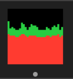

## Summary

This is a C++ FIX based financial exchange designed for algorithmic testing.

__It is a work in progress and under active development.__

ToDo:
- ~~add market/limit order support including execution reports~~
- add multicast market data support for books and trades
- ~~cancel all orders and quotes when session disconnects~~
- possibly add [Nats](https://github.com/nats-io) messaging integration for trade distribution

## Building

The project depends on these other [robaho](https://github.com/robaho) projects.
- [cpp_fixed](https://github.com/robaho/cpp_fixed)
- [cpp_orderbook](https://github.com/robaho/cpp_orderbook)
- [cpp_fix_codec](https://github.com/robaho/cpp_fix_codec)
- [cpp_fix_engine](https://github.com/robaho/cpp_fix_engine)

All should be cloned and built at the same directory level. The `Makefile` includes and library locations can be changed if they are available in a different location.

The project builds by default using `make` and CLang. There is a `Makefile.gcc` for building using GCC.

use `./makeall.sh` to build `cpp-trader` and all dependent projects.

## Testing

use `bin/cpp-trader` to start the exchange.

use `cpp_fix_engine/bin/sample_client` or `cpp_fix_engine/massquote.sh` to start quoting against the exchange.

use `cpp_fix_engine/bin/sample_sendorder` to send a new order and wait for fill or timeout.

use `kill -USR1 <pid>` where `pid` is the exchange process to dump all of the books.

use `make run_tests` to run all of the test cases.

## Performance

using `massquote.sh` and 7 concurrent **FIX** connections on localhost, more than **130k quotes per second**.<sup>1</sup>

as a comparison, using [go-trader](https://github.com/robaho/go-trader) as the exchange, `massquote.sh` on localhost is approximately 35k quotes a second.

<sup>1</sup>These are ping-pong quotes, i.e. send quote, wait for quote ack, send next quote. Streaming quotes are considerably faster.

```
round-trip 100000 MSFT quotes, usec per quote 51.7495, quotes per sec 19323
round-trip 100000 GOOG quotes, usec per quote 51.9119, quotes per sec 19263
round-trip 100000 AAPL quotes, usec per quote 51.8749, quotes per sec 19277
round-trip 100000 ORCL quotes, usec per quote 51.9597, quotes per sec 19245
round-trip 100000 NFLX quotes, usec per quote 52.2649, quotes per sec 19133
round-trip 100000 IBM quotes, usec per quote 52.6779, quotes per sec 18983
round-trip 100000 AMZN quotes, usec per quote 52.7572, quotes per sec 18954
```

Testing over the network (20 Gb/sec lightening), using 75 client processes on the Mac Mini, it achieves just over 85k quotes per sec, which is slightly better than [go-trader](https://github.com/robaho/go-trader) using FIX.

[cpp_fix_engine](https://github.com/robaho/cpp_fix_engine) uses a thread per client model. With many clients, the system CPU usage is very high due to context switching overhead.


## ToDo

Rework [cpp_fix_engine](https://github.com/robaho/cpp_fix_engine) to use "fibers" (aka green threads) to support hundreds of clients with far less cpu overhead while avoiding the complexities of async IO.

Rework `sample_client` to use multiple connections per process with "fibers".
